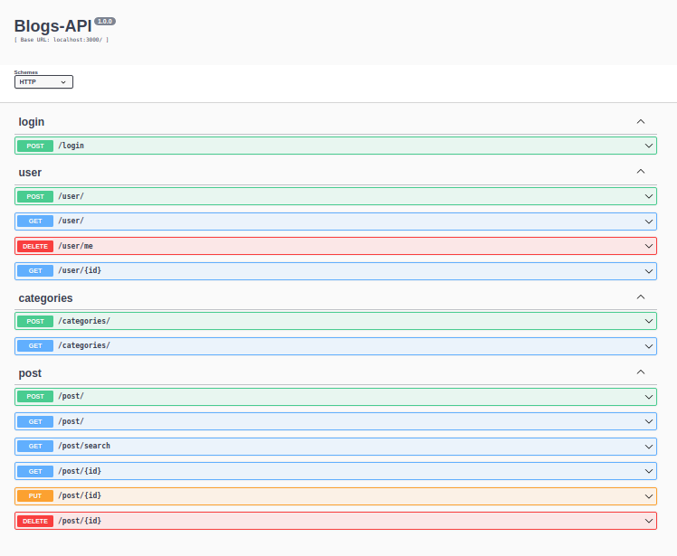

<h1 align="center"> Blogs-API 💻 </h1>

<div align="center">

 
 
 
 
 
 

</div>
<br/> <br/>

<div align="center">


</div>

<h2 align="left"> Sobre: </h2>

<p> Uma API REST de blog posts feita em Node.js, aplicando arquitetura MSC, consumindo o  banco MySql através da criação de models no ORM Sequelize.
</p>

## Tecnologias utilizadas:

- Node.js;
- Express.js;
- JWT;
- Sequelize;
- MySql;
- Arquitetura MSC;

## Rodando o projeto localmente:

```bash
git clone git@github.com:GabrielFerrariR/Blogs-API.git
cd Blogs-API/
npm install
npm start
```

Usando docker

```bash
docker-compose up -d
docker exec -it <container node> bash
npm install
npm run db
npm start 
```

## Visualizando as rotas com Swagger:

Acesse o localhost:PORT/doc para visualizar as rotas da API e suas descrições.

